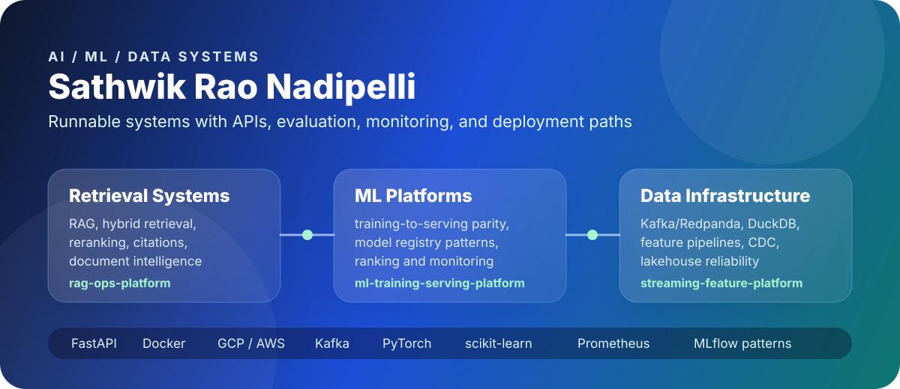

  

  
  
  
  

<h1 align="center">AI / ML / Data Systems Engineer</h1>

  I build production-style AI and data systems with working services, evaluation outputs, monitoring surfaces, and deployment paths.
  My portfolio focuses on RAG, model-serving workflows, streaming feature platforms, data contracts, ranking, recommendations, and applied decision systems.

  <b>M.S., Data Science at Rutgers University</b> · Python · SQL · FastAPI · Docker · Kafka · GCP · AWS · PyTorch · scikit-learn

## First Look

<table>
  <tr>
    <td width="33%" valign="top">
      <h3>Retrieval and GenAI</h3>
      
RAG pipelines, hybrid retrieval, reranking, citations, agent workflows, and document intelligence systems.

      
<a href="https://rag-ops-platform.onrender.com"><b>Open RAG Ops Platform</b></a>

    </td>
    <td width="33%" valign="top">
      <h3>ML and Model Platforms</h3>
      
Training-to-serving parity, model artifact manifests, monitoring reports, ranking, recommendations, and drift checks.

      
<a href="https://ml-training-serving-platform.onrender.com"><b>Open ML Platform</b></a>

    </td>
    <td width="33%" valign="top">
      <h3>Data Infrastructure</h3>
      
Streaming features, CDC contracts, lakehouse validation, online/offline reconciliation, and reliability checks.

      
<a href="https://streaming-feature-platform-demo.onrender.com"><b>Open Feature Platform</b></a>

    </td>
  </tr>
</table>

## Featured Systems

<table>
  <tr>
    <td width="50%" valign="top">
      <h3><a href="https://github.com/srn91/rag-ops-platform">RAG Ops Platform</a></h3>
      
<a href="https://rag-ops-platform.onrender.com">Live demo</a> · FastAPI · hybrid retrieval · reranking · citations

      
Grounded question-answering service with indexed documents, source-backed answers, and evaluation reports.

      
<b>Snapshot:</b> retrieval_hit_rate@3 = 1.0, citation hit rate = 1.0, MRR = 1.0, 11 passing checks.

    </td>
    <td width="50%" valign="top">
      <h3><a href="https://github.com/srn91/streaming-feature-platform">Streaming Feature Platform</a></h3>
      
<a href="https://streaming-feature-platform-demo.onrender.com">Live demo</a> · Redpanda/Kafka · DuckDB · Redis · Prometheus

      
Feature pipeline with event ingestion, online/offline checks, training export, freshness metrics, and GCP dry-run assets.

      
<b>Snapshot:</b> hosted demo, quality summary, feature lookup, training dataset summary, Prometheus-style metrics.

    </td>
  </tr>
  <tr>
    <td width="50%" valign="top">
      <h3><a href="https://github.com/srn91/ml-training-serving-platform">ML Training Serving Platform</a></h3>
      
<a href="https://ml-training-serving-platform.onrender.com">Live demo</a> · scikit-learn · PyTorch · FastAPI · artifacts

      
Train-to-serve workflow with active model metadata, versioned artifacts, monitoring output, and prediction APIs.

      
<b>Snapshot:</b> offline-online parity delta &lt;= 1e-6, multi-version serving, rollback metadata.

    </td>
    <td width="50%" valign="top">
      <h3><a href="https://github.com/srn91/model-monitoring-drift-lab">Model Monitoring Drift Lab</a></h3>
      
<a href="https://model-monitoring-drift-lab.onrender.com">Live demo</a> · PSI · KS · KL · delayed outcomes · reports

      
Monitoring service for feature drift, prediction shift, delayed-outcome quality, and operational reporting.

      
<b>Snapshot:</b> 2,000 reference rows, 5 rolling windows, PSI 2.0372, KS 0.6170.

    </td>
  </tr>
  <tr>
    <td width="50%" valign="top">
      <h3><a href="https://github.com/srn91/ranking-serving-engine">Ranking Serving Engine</a></h3>
      
<a href="https://ranking-serving-engine.onrender.com">Live demo</a> · ranking features · NDCG/MAP · top-k APIs

      
Artifact-backed ranking service with model comparison, query-item features, validation queries, and top-k serving.

      
<b>Snapshot:</b> 12 query groups, NDCG@5/MAP@5 model selection, feature-level score traces.

    </td>
    <td width="50%" valign="top">
      <h3><a href="https://github.com/srn91/recommendation-studio">Recommendation Studio</a></h3>
      
<a href="https://recommendation-studio.onrender.com">Live demo</a> · candidate scoring · reranking · cold-start fallback

      
Recommendation workflow with behavioral reranking, diversity and novelty controls, and serving APIs.

      
<b>Snapshot:</b> 18 users, diversity@5 from 0.4 to 0.6, novelty@5 from 0.19 to 0.5004.

    </td>
  </tr>
</table>

## More Systems

<table>
  <tr>
    <td width="33%" valign="top">
      <h3>Data and Platform</h3>
      
<a href="https://github.com/srn91/lakehouse-reliability-lab">lakehouse-reliability-lab</a> Bronze/silver/gold validation, reconciliation, freshness checks.

      
<a href="https://github.com/srn91/cdc-data-contract-hub">cdc-data-contract-hub</a> Schema compatibility, lineage, exceptions, break alerts.

      
<a href="https://github.com/srn91/job-ops">job-ops</a> Job ingest, dedupe, fit scoring, analytics, FastAPI, Next.js.

    </td>
    <td width="33%" valign="top">
      <h3>Applied ML</h3>
      
<a href="https://github.com/srn91/uplift-decision-engine">uplift-decision-engine</a> 2,400 customers, uplift-at-top-quartile 0.5957, net-value targeting.

      
<a href="https://github.com/srn91/experimentation-lab">experimentation-lab</a> 4,000 users, CUPED, MDE, power, ship/no-ship decisioning.

      
<a href="https://github.com/srn91/document-intelligence-copilot">document-intelligence-copilot</a> Invoice extraction, confidence metadata, validation routing.

    </td>
    <td width="33%" valign="top">
      <h3>Research Systems</h3>
      
<a href="https://github.com/srn91/multi-agent-trading-system">multi-agent-trading-system</a> 2012-2026, 100 stocks, +19.8% CAGR, 0.95 Sharpe.

      
<a href="https://github.com/srn91/gtaa-multi-agent-system">gtaa-multi-agent-system</a> 8-agent tactical allocation, 20.9% CAGR, Monte Carlo stress test.

      
<a href="https://github.com/srn91/systematic_trading_research_engine">systematic_trading_research_engine</a> Purged walk-forward validation, sealed holdout gates, baselines.

    </td>
  </tr>
</table>

## Technical Range

  
  
  
  
  
  
  
  
  
  
  
  

**Data:** Spark, Kafka/Redpanda, Airflow, dbt, Snowflake, Databricks, BigQuery, DuckDB, Redis, CDC, data contracts  
**AI/ML:** scikit-learn, PyTorch, TensorFlow, LightGBM, ranking, recommendations, uplift modeling, A/B testing, causal inference  
**Retrieval:** RAG, LangChain/LangGraph patterns, embeddings, vector retrieval, hybrid BM25+dense retrieval, reranking, citations, evaluation  
**Platform:** FastAPI, Docker, Kubernetes, model serving, CI/CD, Prometheus metrics, drift detection

## Activity

  
  

  

