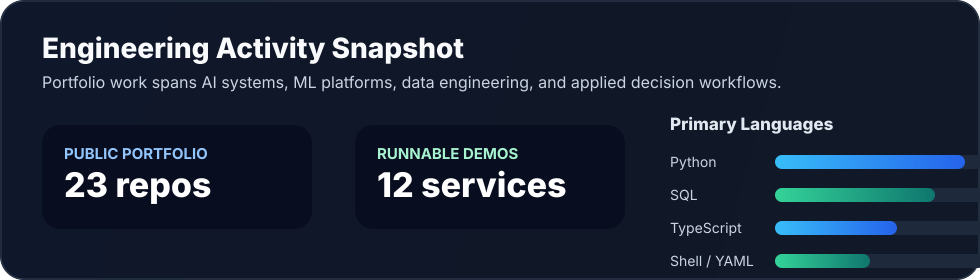

  

  
  
  
  

<h1 align="center">AI / ML / Data Systems Engineer</h1>

  I build production-style AI and data systems with working services, evaluation outputs, monitoring surfaces, and deployment paths.
  My portfolio focuses on RAG, model-serving workflows, streaming feature platforms, data contracts, ranking, recommendations, and applied decision systems.

  <b>M.S., Data Science at Rutgers University</b> · Python · SQL · FastAPI · Docker · Kafka · GCP · AWS · PyTorch · scikit-learn

## Engineering Fast Path

<table>
  <tr>
    <td width="33%" valign="top">
      <h3>Best AI System</h3>
      
<b>RAG Ops Platform</b> Hybrid retrieval, reranking, source citations, and evaluation reports.

      
<b>Metric:</b> citation hit rate 1.0, MRR 1.0, 11 checks passing.

      
<a href="https://rag-ops-platform.onrender.com"><b>Open RAG Ops Platform</b></a>

    </td>
    <td width="33%" valign="top">
      <h3>Best ML Platform</h3>
      
<b>ML Training Serving Platform</b> Versioned model artifacts, active model metadata, parity checks, and prediction APIs.

      
<b>Metric:</b> offline-online parity delta &lt;= 1e-6.

      
<a href="https://ml-training-serving-platform.onrender.com"><b>Open ML Platform</b></a>

    </td>
    <td width="33%" valign="top">
      <h3>Best Data System</h3>
      
<b>Streaming Feature Platform</b> Kafka/Redpanda-style event ingestion, online/offline feature checks, and training export.

      
<b>Metric:</b> 192 demo events, 12 entities, freshness and schema checks.

      
<a href="https://streaming-feature-platform-demo.onrender.com"><b>Open Feature Platform</b></a>

    </td>
  </tr>
</table>

## Flagship Systems

<table>
  <tr>
    <td width="33%" valign="top">
      <h3><a href="https://github.com/srn91/rag-ops-platform">RAG Ops Platform</a></h3>
      
<a href="https://rag-ops-platform.onrender.com">Live demo</a> · <a href="https://github.com/srn91/rag-ops-platform">Repo</a>

      
Grounded question-answering service with indexed documents, source-backed answers, hybrid retrieval, reranking, and evaluation outputs.

      
<b>Headline metric:</b> retrieval_hit_rate@3 = 1.0, citation hit rate = 1.0, MRR = 1.0.

    </td>
    <td width="33%" valign="top">
      <h3><a href="https://github.com/srn91/ml-training-serving-platform">ML Training Serving Platform</a></h3>
      
<a href="https://ml-training-serving-platform.onrender.com">Live demo</a> · <a href="https://github.com/srn91/ml-training-serving-platform">Repo</a>

      
Train-to-serve workflow with model comparison, active model metadata, versioned artifacts, monitoring output, and prediction APIs.

      
<b>Headline metric:</b> offline-online parity delta &lt;= 1e-6 with multi-version serving.

    </td>
    <td width="33%" valign="top">
      <h3><a href="https://github.com/srn91/streaming-feature-platform">Streaming Feature Platform</a></h3>
      
<a href="https://streaming-feature-platform-demo.onrender.com">Live demo</a> · <a href="https://github.com/srn91/streaming-feature-platform">Repo</a>

      
Feature pipeline with event ingestion, online/offline checks, training export, freshness metrics, and GCP dry-run assets.

      
<b>Headline metric:</b> 192 demo events, 12 entities, quality summary and Prometheus-style metrics.

    </td>
  </tr>
</table>

## Proof-of-Work Table

| System | Domain | Stack | Production Signal | Metric | Demo | Repo |
|---|---|---|---|---|---|---|
| RAG Ops Platform | GenAI / Retrieval | FastAPI, hybrid retrieval, reranking | citations, evaluation, grounded answers | MRR 1.0, citation hit rate 1.0 | [demo](https://rag-ops-platform.onrender.com) | [repo](https://github.com/srn91/rag-ops-platform) |
| ML Training Serving Platform | ML Platform | scikit-learn, PyTorch, FastAPI | versioned artifacts, model metadata, parity checks | parity delta &lt;= 1e-6 | [demo](https://ml-training-serving-platform.onrender.com) | [repo](https://github.com/srn91/ml-training-serving-platform) |
| Streaming Feature Platform | Data Infrastructure | Kafka/Redpanda, DuckDB, Redis, FastAPI | online/offline checks, freshness metrics, training export | 192 events, 12 entities | [demo](https://streaming-feature-platform-demo.onrender.com) | [repo](https://github.com/srn91/streaming-feature-platform) |
| Model Monitoring Drift Lab | Model Reliability | PSI, KS, KL, FastAPI | drift, prediction shift, delayed outcomes | PSI 2.0372, KS 0.6170 | [demo](https://model-monitoring-drift-lab.onrender.com) | [repo](https://github.com/srn91/model-monitoring-drift-lab) |
| Ranking Serving Engine | Ranking / Search | feature scoring, NDCG, MAP | top-k APIs, feature traces, model selection | 12 query groups | [demo](https://ranking-serving-engine.onrender.com) | [repo](https://github.com/srn91/ranking-serving-engine) |
| Multi-Agent Trading System | Quant Research | Python, backtesting, agent decisions | walk-forward work, costs, risk controls | +19.8% CAGR, 0.95 Sharpe | [charts](https://github.com/srn91/multi-agent-trading-system/tree/main/reports/charts) | [repo](https://github.com/srn91/multi-agent-trading-system) |

## Supporting Systems

<table>
  <tr>
    <td width="33%" valign="top">
      <h3>Data and Platform</h3>
      
<a href="https://github.com/srn91/lakehouse-reliability-lab">lakehouse-reliability-lab</a> Bronze/silver/gold validation, reconciliation, freshness checks.

      
<a href="https://github.com/srn91/cdc-data-contract-hub">cdc-data-contract-hub</a> Schema compatibility, lineage, exceptions, break alerts.

      
<a href="https://github.com/srn91/job-ops">job-ops</a> Job ingest, dedupe, fit scoring, analytics, FastAPI, Next.js.

    </td>
    <td width="33%" valign="top">
      <h3>Applied ML</h3>
      
<a href="https://github.com/srn91/uplift-decision-engine">uplift-decision-engine</a> 2,400 customers, uplift-at-top-quartile 0.5957, net-value targeting.

      
<a href="https://github.com/srn91/experimentation-lab">experimentation-lab</a> 4,000 users, CUPED, MDE, power, ship/no-ship decisioning.

      
<a href="https://github.com/srn91/document-intelligence-copilot">document-intelligence-copilot</a> Invoice extraction, confidence metadata, validation routing.

    </td>
    <td width="33%" valign="top">
      <h3>Research Systems</h3>
      
<a href="https://github.com/srn91/multi-agent-trading-system">multi-agent-trading-system</a> 2012-2026, 100 stocks, +19.8% CAGR, 0.95 Sharpe.

      
<a href="https://github.com/srn91/gtaa-multi-agent-system">gtaa-multi-agent-system</a> 8-agent tactical allocation, 20.9% CAGR, Monte Carlo stress test.

      
<a href="https://github.com/srn91/systematic_trading_research_engine">systematic_trading_research_engine</a> Purged walk-forward validation, sealed holdout gates, baselines.

    </td>
  </tr>
</table>

## Technical Range

  
  
  
  
  
  
  
  
  
  
  
  

**Data:** Spark, Kafka/Redpanda, Airflow, dbt, Snowflake, Databricks, BigQuery, DuckDB, Redis, CDC, data contracts  
**AI/ML:** scikit-learn, PyTorch, TensorFlow, LightGBM, ranking, recommendations, uplift modeling, A/B testing, causal inference  
**Retrieval:** RAG, LangChain/LangGraph patterns, embeddings, vector retrieval, hybrid BM25+dense retrieval, reranking, citations, evaluation  
**Platform:** FastAPI, Docker, Kubernetes, model serving, CI/CD, Prometheus metrics, drift detection

## Activity

  

  

